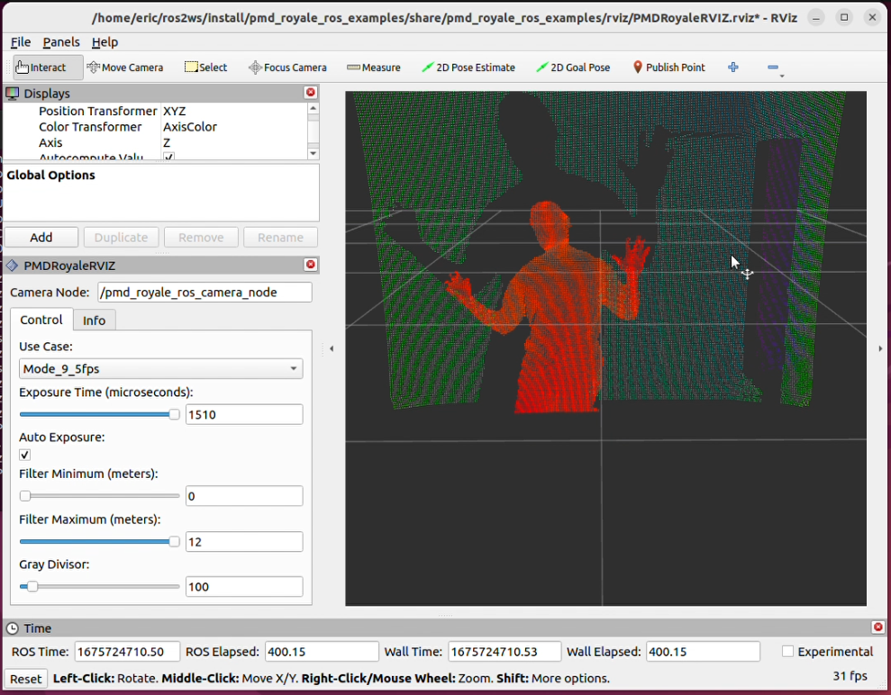

# pmd_royale_ros

pmd_royale_ros is a wrapper for pmd's Royale framework to enable the usage of pmd time-of-flight(TOF) cameras in a ROS2 system.



### Dependencies
- Royale SDK 5.0 or greater
- Ubuntu 22.04
- ROS2 Humble

## Project Organization
pmd_royale_ros is the meta package and depends on two subpackages:
- `pmd_royale_ros_examples` - Launch files and Rviz panel for camera control
- `pmd_royale_ros_driver` - ROS2 node to manage a TOF camera through the pmd Royale libraries

## Build Instructions
1. Create a ROS2 workspace if one does not already exist:
    ```
   mkdir -p ~/ros2ws/src
   ```

2. Clone into the ROS2 workspace folder:
    ```
   cd ~/ros2ws/src
   git clone https://github.com/pmdtechnologies/pmd-royale-ros.git
   ```

3. Setup ROS2 environment:
    ```
   source /opt/ros/humble/setup.bash
   ```

4. Build with symlink:
   ```
   cd ~/ros2ws
   ```

   To build all packages in the workspace including pmd_royale_ros_driver and pmd_royale_ros_examples:
    ```
   colcon build --symlink-install --cmake-args -DCMAKE_PREFIX_PATH=<royale_sdk_path>/share/
   ```

   Where `<royale_sdk_path>` is location of the Royale SDK installation

   To build just pmd_royale_ros_driver:
   ```
   colcon build --packages-select pmd_royale_ros_driver --symlink-install --cmake-args -DCMAKE_PREFIX_PATH=<royale_sdk_path>/share/
   ```

   To build just pmd_royale_ros_examples:
   ```
   colcon build --packages-select pmd_royale_ros_examples --symlink-install
   ```

   Note that the pmd_royale_ros_examples just provides launch files and an RViz panel which does not
   require the Royale SDK installation. This can be useful if you just want to communicate with a
   compatible pmd-royale-ros camera node.


5. Source the setup.bash file or add to the end of your ~/.bashrc:
    ```
   source ~/ros2ws/install/setup.bash
   ```

## Run Instructions
Please see [pmd_royale_ros_examples/README.md](pmd_royale_ros_examples/README.md) for instructions and examples for how to run the camera

Please also note that the very first connection to a pmd camera can take some time (usually no longer than 30 seconds).
This is caused by Royale downloading the camera's calibration data and saving it to cache. Subsequent connection attempts
on the same host should be immediate.
